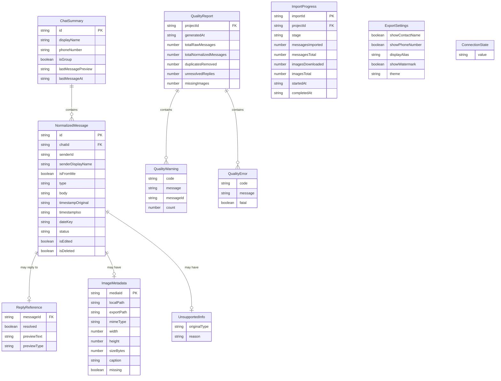

# Data Model: Shared Contracts and Mock Data

**Feature**: `002-shared-contracts-mock-data`
**Date**: 2026-06-09

## Entity Overview

## Entities

### ChatSummary

A compact representation of a single one-to-one conversation for display in
the chat picker list.

| Field | Type | Required | Validation | Notes |
|-------|------|----------|------------|-------|
| `id` | `string` | ✅ | Non-empty | Unique chat identifier from source |
| `displayName` | `string \| null` | ✅ | — | Contact's display name, null if unavailable |
| `phoneNumber` | `string \| null` | ✅ | — | Contact's phone number, null if unavailable |
| `isGroup` | `boolean` | ✅ | Must be `false` for MVP | Filter: only private chats |
| `lastMessagePreview` | `string` | ❌ | Max 200 chars | Truncated last message text |
| `lastMessageAt` | `string` | ❌ | ISO 8601 datetime | Timestamp of most recent message |

**State transitions**: None (static snapshot).

**Lifecycle**: Created when adapter lists chats. Refreshed on re-list.

---

### NormalizedMessage

A single message after normalization. This is the primary data shape consumed
by the preview renderer and export engine.

| Field | Type | Required | Validation | Notes |
|-------|------|----------|------------|-------|
| `id` | `string` | ✅ | Non-empty | Unique message identifier |
| `chatId` | `string` | ✅ | Non-empty | Parent chat reference |
| `senderId` | `string` | ✅ | Non-empty | Sender identifier |
| `senderDisplayName` | `string` | ❌ | — | Human-readable sender name |
| `isFromMe` | `boolean` | ✅ | — | Direction: outgoing vs incoming |
| `type` | `enum` | ✅ | `'text' \| 'image' \| 'deleted' \| 'unsupported'` | Message classification |
| `body` | `string` | ❌ | — | Text content (may be empty for image/deleted) |
| `timestampOriginal` | `string` | ❌ | — | Preserved source timestamp string |
| `timestampIso` | `string` | ✅ | ISO 8601 datetime | Normalized timestamp for sorting |
| `dateKey` | `string` | ✅ | `YYYY-MM-DD` format | Used for date separator grouping |
| `status` | `enum` | ❌ | `'sent' \| 'delivered' \| 'read' \| 'unknown'` | Delivery status |
| `isEdited` | `boolean` | ❌ | — | Whether message was edited |
| `isDeleted` | `boolean` | ❌ | — | Whether message was deleted |
| `replyTo` | `ReplyReference` | ❌ | — | Nested: reply metadata |
| `image` | `ImageMetadata` | ❌ | — | Nested: image-specific data |
| `unsupported` | `UnsupportedInfo` | ❌ | — | Nested: unsupported-type data |

**Identity**: Uniqueness by `id` within a chat.

**Ordering**: Messages are ordered by `timestampIso` ascending within a chat.

---

### ReplyReference (nested in NormalizedMessage)

Metadata about a reply relationship.

| Field | Type | Required | Validation | Notes |
|-------|------|----------|------------|-------|
| `messageId` | `string` | ❌ | — | ID of the message being replied to |
| `resolved` | `boolean` | ✅ | — | Whether the referenced message was found |
| `previewText` | `string` | ❌ | — | Snippet of the replied-to message |
| `previewType` | `string` | ❌ | — | Type of the replied-to message |

---

### ImageMetadata (nested in NormalizedMessage)

Metadata and file references for image messages.

| Field | Type | Required | Validation | Notes |
|-------|------|----------|------------|-------|
| `mediaId` | `string` | ✅ | Non-empty | Unique media identifier |
| `localPath` | `string` | ✅ | Non-empty | Path within project `media/` folder |
| `exportPath` | `string` | ✅ | Non-empty | Relative path in export `assets/` |
| `mimeType` | `string` | ❌ | Valid MIME | e.g., `image/jpeg`, `image/png` |
| `width` | `number` | ❌ | Positive integer | Image width in pixels |
| `height` | `number` | ❌ | Positive integer | Image height in pixels |
| `sizeBytes` | `number` | ❌ | Non-negative | File size in bytes |
| `caption` | `string` | ❌ | — | Image caption text |
| `missing` | `boolean` | ❌ | — | `true` if media file could not be downloaded |

---

### UnsupportedInfo (nested in NormalizedMessage)

Metadata for messages of unrecognized types (Constitution XXIII — no silent
data loss).

| Field | Type | Required | Validation | Notes |
|-------|------|----------|------------|-------|
| `originalType` | `string` | ✅ | Non-empty | The original type string from the source |
| `reason` | `string` | ✅ | Non-empty | Why this type is unsupported |

---

### QualityReport

Summary of data accuracy produced after import/normalization
(Constitution VIII).

| Field | Type | Required | Validation | Notes |
|-------|------|----------|------------|-------|
| `projectId` | `string` | ✅ | Non-empty | Associated project |
| `generatedAt` | `string` | ✅ | ISO 8601 datetime | When the report was generated |
| `totalRawMessages` | `number` | ✅ | Non-negative | Count before normalization |
| `totalNormalizedMessages` | `number` | ✅ | Non-negative | Count after normalization |
| `duplicatesRemoved` | `number` | ✅ | Non-negative | Deduplication count |
| `unresolvedReplies` | `number` | ✅ | Non-negative | Replies with missing targets |
| `missingImages` | `number` | ✅ | Non-negative | Images that failed download |
| `unsupportedMessageTypes` | `Record<string, number>` | ✅ | — | Count by original type |
| `dateRange.from` | `string \| null` | ✅ | ISO 8601 or null | Earliest message |
| `dateRange.to` | `string \| null` | ✅ | ISO 8601 or null | Latest message |
| `warnings` | `QualityWarning[]` | ✅ | — | Non-fatal issues |
| `errors` | `QualityError[]` | ✅ | — | Fatal or critical issues |

---

### QualityWarning / QualityError

| Field | Type | Required | Validation | Notes |
|-------|------|----------|------------|-------|
| `code` | `string` | ✅ | Non-empty | Machine-readable error code |
| `message` | `string` | ✅ | Non-empty | Human-readable description |
| `messageId` | `string` | ❌ | — | (Warning only) Related message |
| `count` | `number` | ❌ | — | (Warning only) Occurrence count |
| `fatal` | `boolean` | ✅ | — | (Error only) Whether it blocks further processing |

---

### ConnectionState

The current status of the messaging adapter connection.

| Value | Description |
|-------|-------------|
| `disconnected` | Not connected, no session |
| `initializing` | Adapter starting up |
| `waiting_for_qr` | Ready for QR scan |
| `qr_ready` | QR code available for display |
| `connecting` | QR scanned, establishing session |
| `connected` | Fully connected and operational |
| `session_expired` | Previous session no longer valid |
| `connection_failed` | Connection attempt failed |

**State transitions**: `disconnected → initializing → waiting_for_qr → qr_ready → connecting → connected`. Error paths: `* → session_expired`, `* → connection_failed`, `* → disconnected` (via logout/destroy).

---

### ImportProgress

Real-time status indicator for an ongoing import operation.

| Field | Type | Required | Validation | Notes |
|-------|------|----------|------------|-------|
| `importId` | `string` | ✅ | Non-empty | Unique import operation ID |
| `projectId` | `string` | ✅ | Non-empty | Associated project |
| `stage` | `ImportStage` | ✅ | Valid enum value | Current pipeline stage |
| `messagesImported` | `number` | ✅ | Non-negative | Messages processed so far |
| `messagesTotal` | `number` | ❌ | Positive | Total expected (if known) |
| `imagesDownloaded` | `number` | ✅ | Non-negative | Images downloaded so far |
| `imagesTotal` | `number` | ❌ | Positive | Total expected (if known) |
| `warnings` | `string[]` | ✅ | — | Warnings accumulated during import |
| `startedAt` | `string` | ✅ | ISO 8601 datetime | Import start time |
| `completedAt` | `string` | ❌ | ISO 8601 datetime | Import end time |

**ImportStage values**: `preparing_project → fetching_metadata → fetching_messages → saving_raw_messages → downloading_images → normalizing → resolving_replies → generating_quality_report → preparing_preview → completed`. Error: `failed`, `cancelled`.

---

### ExportSettings

User's privacy and presentation choices for export
(Constitution XII).

| Field | Type | Required | Validation | Notes |
|-------|------|----------|------------|-------|
| `showContactName` | `boolean` | ✅ | — | Show/hide contact display name |
| `showPhoneNumber` | `boolean` | ✅ | — | Show/hide phone number |
| `displayAlias` | `string` | ❌ | — | Override display name in export |
| `showWatermark` | `boolean` | ✅ | — | "Exported by ChatFrame" watermark |
| `theme` | `enum` | ✅ | `'light' \| 'dark'` | Visual theme for export |

**Defaults**: `showContactName: true`, `showPhoneNumber: false`,
`showWatermark: true`, `theme: 'light'`.

## Validation Strategy

All Zod schemas are co-located with their type definitions in
`packages/shared/src/schemas/`. Each schema uses `z.infer<>` to derive the
TypeScript type, ensuring zero drift.

**Validation boundaries** (Constitution XIV):
1. **API request bodies** — Fastify route handlers validate incoming data
   using Zod schemas before processing.
2. **Adapter outputs** — Data returned from `WhatsAppAdapter` methods is
   validated before entering core logic.
3. **Storage reads** — Data read from JSON/NDJSON files is validated before
   use.
4. **Frontend API responses** — TanStack Query hooks validate response data
   using shared schemas.

**Error format**: Zod's `ZodError` is transformed into a structured error
response with per-field paths and messages, satisfying FR-012.
